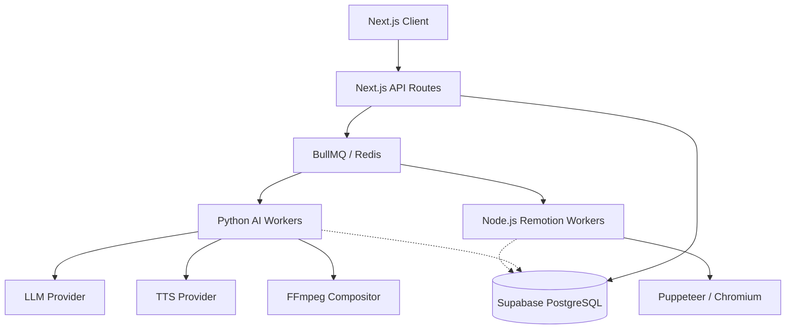

# Architecture

This document outlines the high-level architecture of the AIVA platform as implemented in Phase 1. For deeper engineering principles, see [docs/EDD.md](docs/EDD.md).

## System Overview

AIVA is an event-driven, distributed system. The orchestration is handled centrally, but the heavy lifting (Machine Learning, Video Rendering, Asset Resolution) is strictly isolated into specialized worker pools.



## Core Components

### 1. Next.js Orchestrator & UI (`apps/web`)
Acts as the central nervous system. It manages user authentication (via Supabase Auth), accepts topic submissions, writes the initial job state to the database, and dispatches the job to BullMQ.

### 2. Job Queue (`BullMQ` + `Redis`)
All inter-service coordination happens through a Redis-backed BullMQ queue. The pipeline execution is stateful and resumable. If a Python worker crashes during a 30-minute render, the queue guarantees a retry with exponential backoff.

### 3. Database (`Supabase`)
The central source of truth. The schema normalizes `projects`, `jobs`, `scenes` (and their `scene_versions`), `animation_rigs`, and `cost_ledger_entries`. Row Level Security (RLS) guarantees data isolation.

### 4. Python ML/AV Workers (`apps/workers`)
A FastAPI-based Python fleet responsible for:
- **Core AI Agent Chain**: Research, Outline, Scripting, and Directing.
- **Audio Pipeline**: TTS synthesis and Faster-Whisper subtitle timing extraction.
- **Asset Pipeline**: Semantic stock media matching and fallback image generation.
- **Media Composition**: The FFmpeg engine.

### 5. Template Renderer (`apps/template-renderer`)
A Node.js service running Remotion. It takes a strict `PipelineIR` (Intermediate Representation) JSON payload and returns a hardware-accelerated, transparent WebM video of the scene's visual layers (e.g., stickman animations or documentary pan/zooms). It operates entirely independently of business logic.

### 6. Media Composition Engine
Resides within the Python workers. It is not a monolithic script; it is a decoupled engine comprising an `AudioMixer`, `SubtitleGenerator`, `FilterGraphBuilder`, and `Encoder`. It receives a `CompositionModel` and deterministically builds an FFmpeg filter graph to stitch WebM overlays, ducked background music, and TTS together.

### 7. Telemetry & Cost Tracking
Telemetry is treated strictly as an infrastructure concern. A `TelemetryClient` provides non-blocking context managers (`with track_span()`) that wrap all external API calls. Usage metrics are normalized by a `ProviderUsageCollector` and priced via a `PricingCatalog` before being persisted to the `cost_ledger_entries` table.

## Data Contracts

The pipeline relies on strict, versioned JSON contracts to pass data between isolated systems.

1. **`PipelineState`**: The internal database representation of a job in progress.
2. **`PipelineIR`**: The Intermediate Representation. This is the canonical, deterministic "recipe" generated after all AI decisions are made. The Remotion renderer consumes this directly.
3. **`CompositionModel`**: The strict contract sent to the FFmpeg engine dictating exactly how media tracks align on the final timeline.

## Provider Abstraction

AIVA enforces strict isolation between business logic and external APIs.

```python
ILLMProvider
  ├── GeminiProvider
  ├── GroqProvider
  └── MockLLMProvider (Deterministic CI)
```

The pipeline orchestrator never imports SDKs directly. All external dependencies (LLMs, TTS, Image Generators, Stock APIs) conform to standardized TypeScript and Python interfaces.
