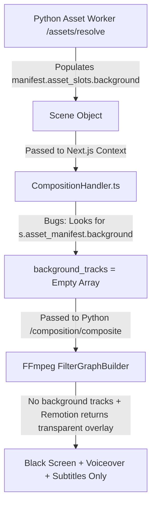
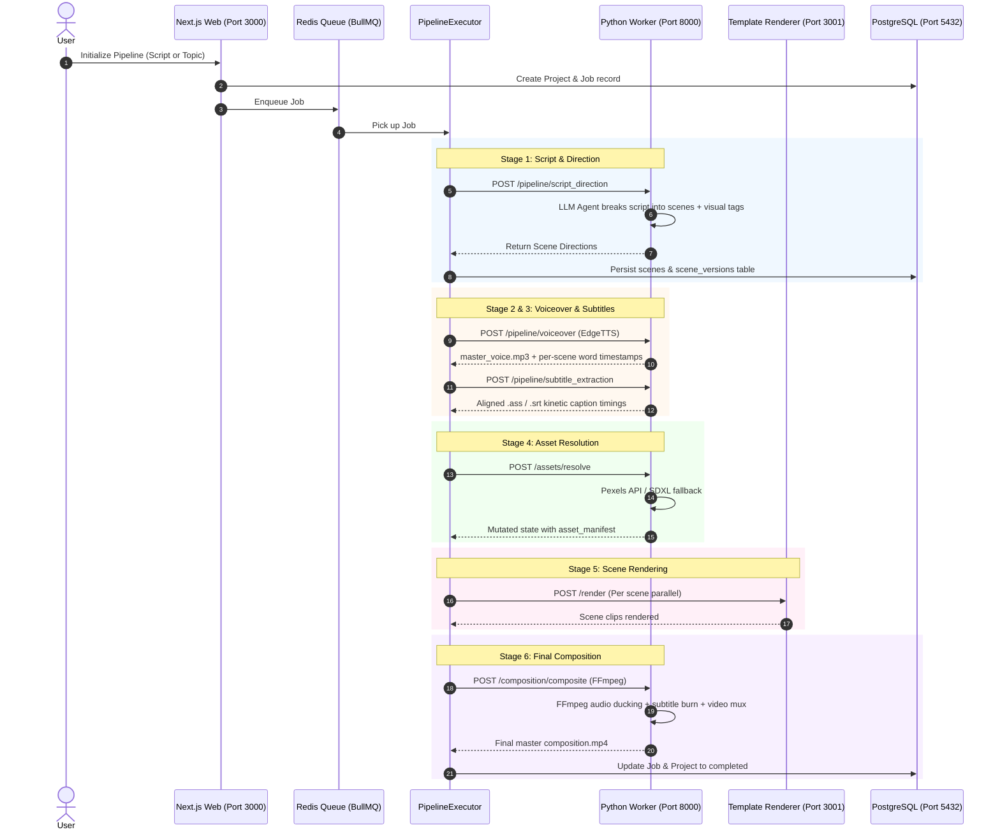
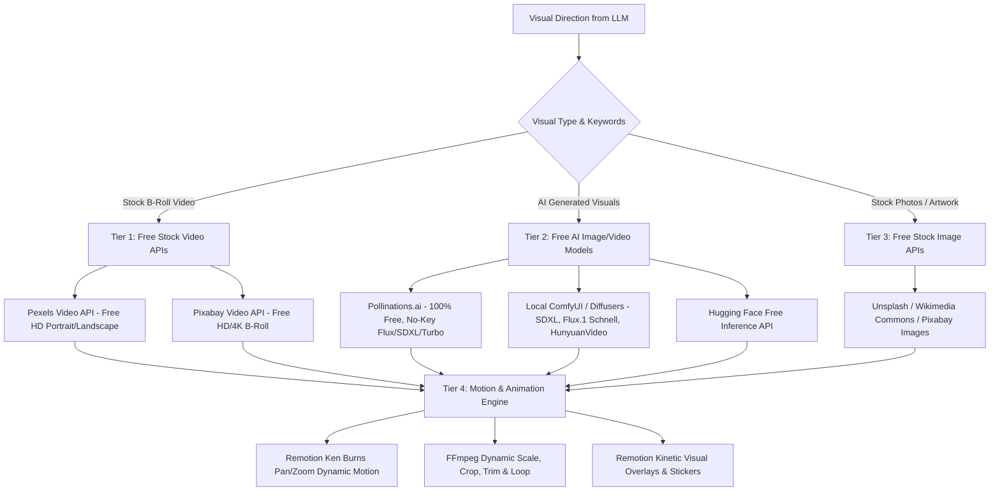

# AIVA Video Generation Pipeline: Current State & Visual Architecture Plan

## Executive Summary

When analyzing the generated composition `storage/projects/f641f1e1-2370-45cd-9e07-31f0e2515a3e/composition.mp4`, the audio voiceover and kinetic subtitles functioned properly, but the visual layer was completely blank/black.

This document breaks down:
1. **The Exact Root Cause** why video footage was omitted from the composition.
2. **The Current End-to-End Pipeline Process** (Architecture, stage flow, data structures).
3. **Free Video & Visual Generation Models / Providers** (Pexels, Pixabay, Pollinations.ai, Local ComfyUI/Diffusers, Remotion Ken Burns).
4. **Architectural Deep Plan** to transform the pipeline into a rich, dynamic, multi-modal video production engine.

---

## 1. Root Cause Analysis: Why Visuals Were Missing

Tracing the exact execution of project `30bc85f5` / job `f641f1e1`:



### The 3 Contributing Defects:

1. **Object Path Mismatch in `CompositionHandler.ts`:**
   - In Python `apps/workers/app/routers/assets.py`, the asset manifest is structured as:
     `scene["asset_manifest"]["asset_slots"]["background"] = { "storage_key": "...", ... }`
   - In `apps/web/src/services/pipeline/handlers/CompositionHandler.ts`, the code queried:
     `s.asset_manifest?.background?.storage_key` (missing `asset_slots`).
   - As a result, `rawBgTracks` evaluated to `[]` (empty list), omitting all downloaded stock video/image assets from FFmpeg inputs.

2. **Template Renderer Stubs in `template-renderer`:**
   - In `apps/template-renderer/src/templates/ken-burns/KenBurns.tsx` and `character-rig/CharacterRig.tsx`, the Remotion templates returned:
     ```tsx
     <AbsoluteFill style={{ backgroundColor: 'transparent' }} />
     ```
   - When no background tracks were supplied to FFmpeg and Remotion rendered a transparent frame, FFmpeg placed the transparent frame on a black canvas.

3. **Per-Scene Asset URL Missing in `RenderHandler.ts`:**
   - In `apps/web/src/services/pipeline/handlers/RenderHandler.ts`, `sceneIR.scenes[0].assetUrl` was mapped to `s.assetUrl` instead of checking `s.asset_manifest?.asset_slots?.background?.storage_key` or `s.asset_manifest?.background?.storage_key`.

---

## 2. Current End-to-End Pipeline Architecture

Here is how the pipeline is orchestrated right now across the 6 stages:



---

## 3. How to Use Free Models & Providers for Video Generation

To make video generation rich, dynamic, visually cinematic, and 100% free/open, we can use a **Multi-Tier Visual Strategy**:



### Breakdown of Free Provider Options:

| Provider / Model | Type | Cost / Requirements | Resolution / Quality | Best Use Case |
| :--- | :--- | :--- | :--- | :--- |
| **Pexels Video API** | Real Stock Video | **100% Free** (API Key) | 1080x1920 HD / 4K | Real-world footage, nature, urban, lifestyle, coffee, science |
| **Pixabay Video API** | Real Stock Video & Animations | **100% Free** (API Key) | 1080x1920 HD / 4K | Abstract 3D motion backgrounds, space, history, high-res stock |
| **Pollinations.ai** | AI Image & Video Generation | **100% Free** (Zero Key, Zero Setup) | Up to 1080x1920 Flux / SDXL | Unique sci-fi, historical recreations, fantasy concepts |
| **Local ComfyUI / Diffusers** | Local Text-to-Image & Image-to-Video | **100% Free** (Local GPU) | Full Resolution (SDXL, Wan2.1, CogVideoX) | Offline generation, exact custom style consistency |
| **Remotion Ken Burns Motion Engine** | Dynamic Motion on Still Visuals | **100% Free** (Built-in) | 60 FPS Smooth Pan/Zoom/Parallax | Turning still AI images and photos into cinematic moving scenes |

---

## 4. Deep Plan: Upgrading Visual Generation & Editing

### Phase 1: Dual-Source Free Stock Engine (Pexels + Pixabay)
- Add **Pixabay Video & Image Provider** alongside Pexels.
- Chain Pexels $\rightarrow$ Pixabay $\rightarrow$ AI Image Generation $\rightarrow$ Curated Fallback.
- Normalize asset extraction so video clips are trimmed or looped to match the exact scene voice duration.

### Phase 2: Remotion Ken Burns & Visual Animation Engine
- Upgrade `apps/template-renderer/src/templates/ken-burns/KenBurns.tsx` to accept the actual image/video asset URL.
- Implement high-smoothness spring-based **Ken Burns pan, tilt, zoom, and parallax** with subtle particle/light-leak overlays.
- Support video backgrounds directly inside Remotion with video looping/speed adjustment.

### Phase 3: Free AI Generation Integration (Pollinations.ai + Local SDXL)
- Integrate Pollinations.ai endpoint (`https://image.pollinations.ai/prompt/{prompt}?width=1080&height=1920&nologo=true&model=flux`) for instant zero-key AI image generation when stock video matches are unavailable.
- Provide ComfyUI / Diffusers hook for local GPU users.

### Phase 4: FFmpeg Multi-Track Video Stitching & Transitions
- Fix `CompositionHandler.ts` asset slots mapping so all scene background videos are passed into FFmpeg.
- Apply cross-dissolve (`xfade`) transitions between sequential video scenes.
- Ensure audio auto-ducking dynamically lowers background music by -14dB during voice segments.

---

## 5. Next Steps

1. **Review & Approval**: Align on the visual provider strategy (Pexels + Pixabay + Pollinations.ai + Remotion Ken Burns).
2. **Implementation**: Fix asset slot data mapping, enable Ken Burns in Remotion, and wire the visual renderer end-to-end.
3. **Verification**: Run a full generation with video footage verification.
